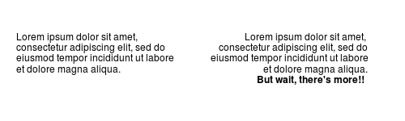
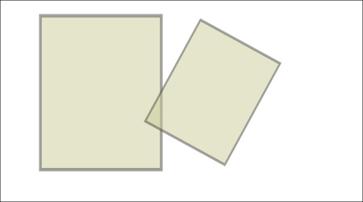
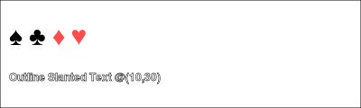
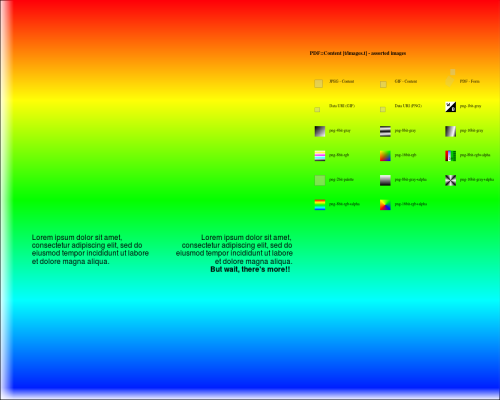

# PDF::Lite

`PDF::Lite` is a minimal class for creating or editing PDF documents, including:
- Basic Text (core fonts only)
- Simple forms and images (GIF, JPEG & PNG)
- Graphics and Drawing
- Content reuse (Pages and form objects)
```
use v6;
use PDF::Lite;

my $pdf = PDF::Lite.new;
my $page = $pdf.add-page;
$page.MediaBox = [0, 0, 200, 100];

$page.graphics: {
    my $text-block = .text: {
        .font = .core-font( :family<Helvetica>, :weight<bold>, :style<italic> );
        .TextMove = [10, 10];
        .say: 'Hello, world';
    }

    my $img = .load-image: "t/images/lightbulb.gif";
    .do($img, 20 + $text-block.width, 10);
}

my $info = $pdf.Info = {};
$info.CreationDate = DateTime.now;

$pdf.save-as: "examples/hello-world.pdf";
```


#### Text

`.say` and `.print` are simple convenience methods for displaying simple blocks of text with optional line-wrapping, alignment and kerning.

These methods return a text-block object which can be used to
determine the actual width and height of the displayed text block;

```
use PDF::Lite;
my $pdf = PDF::Lite.new;
my $page = $pdf.add-page;
$page.MediaBox = [0, 0, 500, 150];
my $font = $page.core-font( :family<Helvetica> );

$page.text: -> $txt {
    my $para = q:to"--END--";
    Lorem ipsum dolor sit amet, consectetur adipiscing elit, sed do eiusmod tempor incididunt
    ut labore et dolore magna aliqua.
    --END--
            
    $txt.font = $font, 12;
    # output a text box with left, top corner at (20, 100)
    my $text-block = $txt.say( $para, :width(200), :position[ :left(20), :top(100)] );
    say "text height: {$text-block.height}";

    # output kerned paragraph, flow from right to left, right, top edge at (450, 100)
    $txt.say( $para, :width(200), :height(150), :align<right>, :kern, :position[450, 100] );
    # add another line of text, flowing on to the next line
    $txt.font = $page.core-font( :family<Helvetica>, :weight<bold> ), 12;
    $txt.say( "But wait, there's more!!", :align<right>, :kern );
}

$pdf.save-as: "examples/sample-text.pdf";
```




#### Images (`.load-image` and  `.do` methods):

The `.image` method can be used to open an image.
The `.do` method can them be used to render it.

```
use PDF::Lite;
my $pdf = PDF::Lite.new;
my $page = $pdf.add-page;
$page.MediaBox = [0, 0, 450, 250];

$page.graphics: -> $gfx {
    my $img = $gfx.load-image("t/images/snoopy-happy-dance.jpg");
    $gfx.do($img, 50, 40, :width(150) );

    # displays the image again, semi-transparently with translation, rotation and scaling

    $gfx.transform( :translate[180, 100]);
    $gfx.transform( :rotate(-.5), :scale(.75) );
    $gfx.FillAlpha = 0.5;
    $gfx.do($img, :width(150) );
}
$pdf.save-as: "examples/sample-image.pdf";
```




Note: at this stage, only the `JPEG`, `GIF` and `PNG` image formats are supported.

For a full table of `.set-graphics` options, please see PDF::Content::Ops, ExtGState enumeration.

### Text effects

To display card suits symbols, using the ZapfDingbats core-font, with diamonds and hearts colored red:

```
use PDF::Lite;
my $pdf = PDF::Lite.new;
my $page = $pdf.add-page;
$page.MediaBox = [0, 0, 400, 120];

$page.graphics: {

    $page.text: {
	.TextMove = [20, 70];
	.font = [ .core-font('ZapfDingbats'), 24];
	.WordSpacing = 16;
	.print("♠ ♣\c[NO-BREAK SPACE]");
	.FillColor = :DeviceRGB[ 1, .3, .3];  # reddish
	.say("♦ ♥");
    }

    # Display outline, slanted text, using the ShowText (`Td`) operator:

    my $header-font = $page.core-font( :family<Helvetica>, :weight<bold> );

    $page.text: {
	 use PDF::Content::Ops :TextMode;
	.font = ( $header-font, 18);
	.TextRender = TextMode::FillOutlineText;
	.LineWidth = .5;
        .text-transform( :skew[0, -6], :translate[10, 30] );
	.FillColor = :DeviceRGB[ .6, .7, .9];
	.ShowText('Outline Slanted Text @(10,30)');
    }
}

$pdf.save-as: "examples/text-effects.pdf";

```



Note: only the PDF core fonts are supported: Courier, Times, Helvetica, ZapfDingbats and Symbol.

#### Forms

Forms are a reusable graphics component


#### Colors and Patterns

### Resources and Reuse

The `to-xobject` method can be used to convert a page to an XObject Form to lay-up one or more input pages on an output page.

```
use PDF::Lite;
my $pdf-with-images = PDF::Lite.open: "t/images.pdf";
my $pdf-with-text = PDF::Lite.open: "examples/sample-text.pdf";

my $new-doc = PDF::Lite.new;

# add a page; layup imported pages and images
my $page = $new-doc.add-page;
$page.MediaBox = [0, 0, 500, 400];

my $xobj-image = $pdf-with-images.page(1).images[6];
my $xobj-with-text  = $pdf-with-text.page(1).to-xobject;
my $xobj-with-images  = $pdf-with-images.page(1).to-xobject;

$page.graphics: {
     # scale up the image; use it as a background
    .do($xobj-image, 6, 6, :width(500), :height(400) );

     # overlay pages; scale these down
    .do($xobj-with-text, 20, 100, :width(300) );
    .do($xobj-with-images, 300, 100, :width(200) );
}

# copy whole pages from a document
for 1 .. $pdf-with-text.page-count -> $page-no {
    $new-doc.add-page: $pdf-with-text.page($page-no);
}

$new-doc.save-as: "examples/reuse.pdf";

```




To list all images and forms for each page
```
use PDF::Lite;
my $pdf = PDF::Lite.open: "t/images.pdf";
for 1 ... $pdf.page-count -> $page-no {
    say "page: $page-no";
    my $page = $pdf.page: $page-no;
    my %object = $page.resources('XObject');

    # also report on images embedded in the page content
    my $k = "(inline-0)";

    %object{++$k} = $_
        for $page.gfx.inline-images;

    for %object.keys -> $key {
        my $xobject = %object{$key};
        my $subtype = $xobject<Subtype>;
        my $size = $xobject.encoded.codes;
        say "\t$key: $subtype $size bytes"
    }
}

```

Resource types are: `ExtGState` (graphics state), `ColorSpace`, `Pattern`, `Shading`, `XObject` (forms and images) and `Properties`.

Resources of type `Pattern` and `XObject/Image` may have further associated resources.

Whole pages or individual resources may be copied from one PDF to another.

## Operators

PDF::Content inherits from PDF::Content::Op, which implements the full range of PDF content operations for handling text, images and graphics coordinates:

```
use PDF::Lite;
my $pdf = PDF::Lite.new;
my $page = $pdf.add-page;

# Draw a simple Bézier curve:

# ------------------------
# Alternative 1: Using operator functions (see PDF::Content)

sub draw-curve1($gfx) {
    $gfx.Save;
    $gfx.MoveTo(175, 720);
    $gfx.LineTo(175, 700);
    $gfx.CurveToInitial( 300, 800,  400, 720 );
    $gfx.ClosePath;
    $gfx.Stroke;
    $gfx.Restore;
}

draw-curve1($page.gfx);

# ------------------------
# Alternative 2: draw from content instructions string:

sub draw-curve2($gfx) {
    $gfx.ops: q:to"--END--"
        q                     % save
          175 720 m           % move-to
          175 700 l           % line-to
          300 800 400 720 v   % curve-to
          h                   % close
          S                   % stroke
        Q                     % restore
        --END--
}
draw-curve2($pdf.add-page.gfx);

# ------------------------
# Alternative 3: draw from raw data

sub draw-curve3($gfx) {
    $gfx.ops: [
         'q',               # save,
         :m[175, 720],      # move-to
         :l[175, 700],      # line-to 
         :v[300, 800,
            400, 720],      # curve-to
         :h[],              # close (or equivalently, 'h')
         'S',               # stroke (or equivalently, :S[])
         'Q',               # restore
     ];
}
draw-curve3($pdf.add-page.gfx);

```
For a full list of operators, please see PDF::Content::Ops.

## Graphics State

A number of variables are maintained that describe the graphics state. In many cases these may be set directly:

```
my $page = (require PDF::Lite).new.add-page;
$page.graphics: {

    .Save;  # save current graphics state
    .CharSpacing = 1.0;     # show text with wide spacing
    # Set the font to twelve point helvetica
    my $face = .core-font( :family<Helvetica>, :weight<bold>, :style<italic> );
    .font = [ $face, 12 ];
    .TextLeading = 12; # new-line advances 12 points
    .say("Sample Text", :position[10, 20]);
    # 'say' has updated the text position to the next line
    .Restore; # restore previous graphics state
    say .CharSpacing; # restored to 0
}
```

## See also

- PDF::Lites is based on [PDF](https://github.com/p6-pdf/PDF-p6) and has all of it methods available. This includes:

    - `open` to read an existing PDF or JSON file
    - `save-as` to save to PDF or JSON
    - `update` to perform an in-place incremental update of the PDF
    - `Info` to access document meta-data

- [PDF::Content](https://github.com/p6-pdf/PDF-Content-p6) provides core graphics support. Please see the README for and PDF::Content::Ops POD a description of available operators and graphics.

